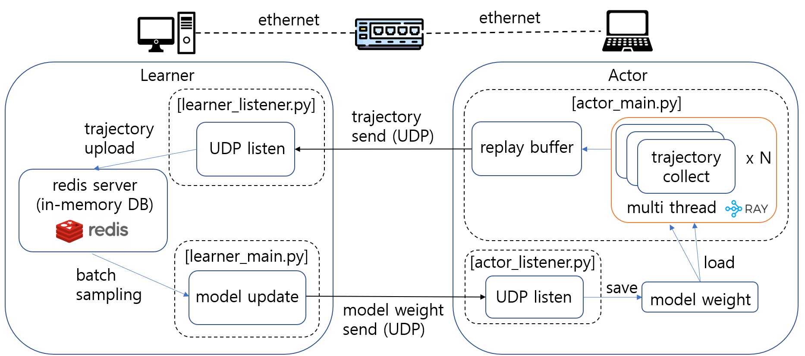
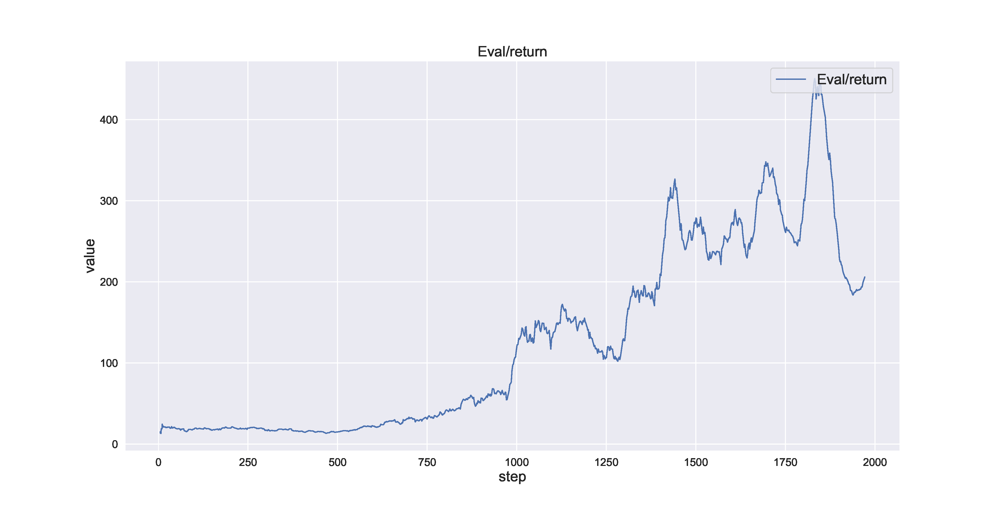

# IMPALA-distributed-RL
implementation of IMPALA: Scalable Distributed Deep-RL with Importance Weighted Actor-Learner Architectures(deepmind 2018) as distributed machine settings

## System overview


## Usage
for single machine experiments
```
python single_machine_single_thread/experiments.py
```

for multi machine experiments
```
#on actor machine
cd multi_machine_multi_thread/actor_code
python actor_listener.py
python actor_main.py
```
```
#on learner machine
#run redis server first
cd multi_machine_multi_thread/learner_code
python learner_listener.py
python learner_main.py
```

Dependency: 

-python 3.7

-torch: 1.8.0

-gym: 0.21.0

-cuda: 12.1

## Experimental results
on CartPole-v1 environment

